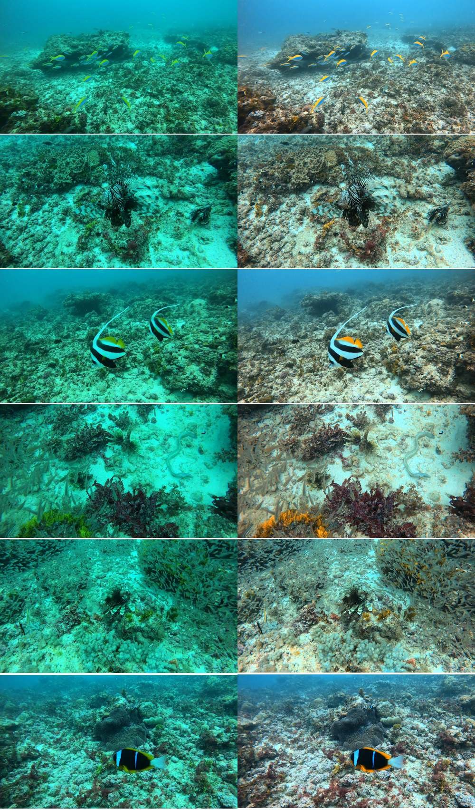
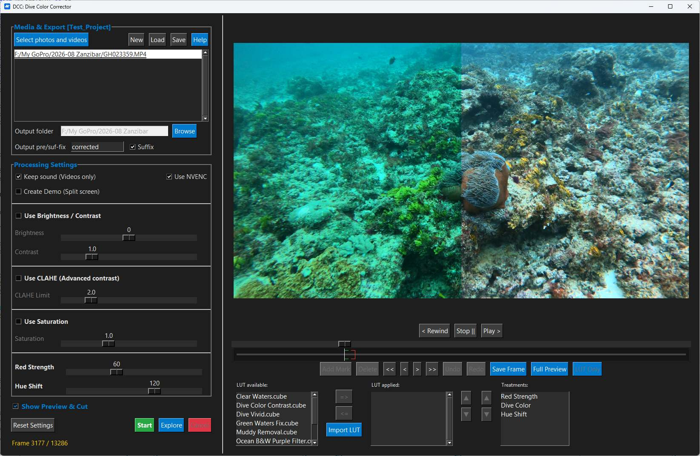

## Dive and underwater image and video color correction

**Sample images**



**Sample video**

[](https://youtu.be/XuDRmIuE3F4)

### Setup
```
$ pip install -r requirements.txt
```

## GUI
You can either download the [desktop softwares](https://github.com/vletroye/dive-color-corrector) or build one yourself.



### Building the GUI
Uncomment the libraries needed for GUI in `requirements.txt` and re-run `pip install`.

MacOS (via Py2App)
```
$ py2applet --make-setup dcc.py
$ python setup.py py2app
```

Windows (via PyInstaller)
```
$ python -m PyInstaller -n "Dive Color Corrector" -F -w -i .\logo\logo.ico dcc.py
```

Linux (via PyInstaller)
```
$ pyinstaller -n "Dive Color Corrector" -F -w -i ./logo/logo.png dcc.py
```

Final builds will be available in 'dist' folder


### Inspiration
This fork is based on [https://bornfree.github.io/dive-color-corrector/](https://bornfree.github.io/dive-color-corrector/) (originally originating from the algorithm at [https://github.com/nikolajbech/underwater-image-color-correction](https://github.com/nikolajbech/underwater-image-color-correction)).
